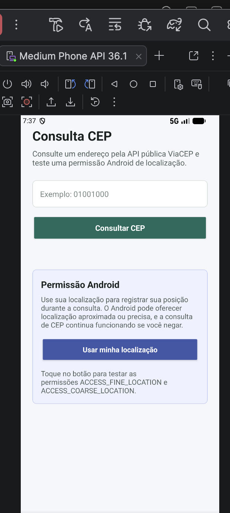
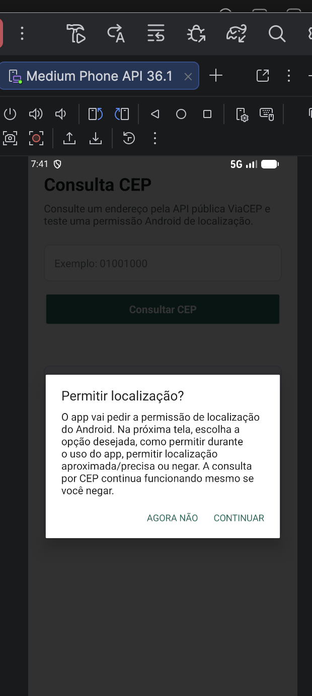
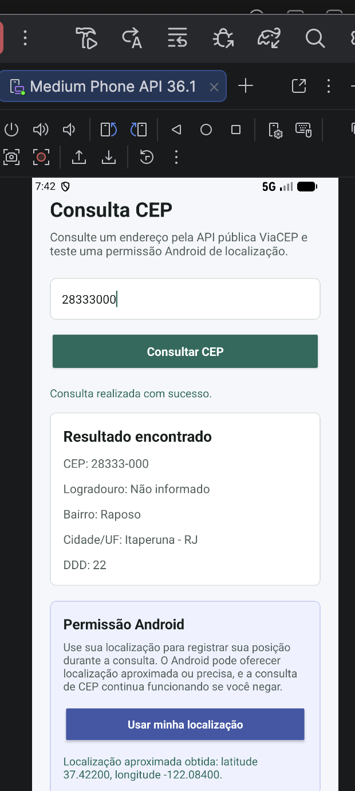

# Consulta CEP — Versão com Permissão Android

## Descrição
Aplicativo Android nativo que consulta endereços brasileiros pelo CEP usando a API pública ViaCEP. Esta versão evolui o projeto anterior adicionando uma funcionalidade com permissão Android de localização.

## Relação com a atividade anterior
A atividade anterior permitia digitar um CEP, consultar a API ViaCEP e exibir dados do endereço. Nesta versão, o app mantém esse fluxo e adiciona o botão **Usar minha localização**, que explica o motivo da permissão, solicita autorização em tempo de execução e mostra a latitude/longitude quando disponível.

## API utilizada
- Nome da API: ViaCEP
- Endpoint utilizado: `https://viacep.com.br/ws/{cep}/json/`
- Dados exibidos no app: CEP, logradouro, bairro, cidade, UF e DDD.

## Permissão Android utilizada
- Permissão escolhida: `ACCESS_FINE_LOCATION` e `ACCESS_COARSE_LOCATION`
- Onde ela foi declarada no Manifest: `app/src/main/AndroidManifest.xml`
- Por que essa permissão é necessária para o app: ela permite obter a localização do usuário como apoio ao fluxo de consulta de endereço.
- Em qual momento do fluxo ela é solicitada ao usuário: somente quando o usuário toca no botão **Usar minha localização**.

```xml
<uses-permission android:name="android.permission.ACCESS_COARSE_LOCATION" />
<uses-permission android:name="android.permission.ACCESS_FINE_LOCATION" />
```

O app também usa `INTERNET` para consultar a API ViaCEP.

```xml
<uses-permission android:name="android.permission.INTERNET" />
```

## Fluxo da permissão
1. Se a permissão já foi concedida, o app tenta obter a localização e mostra latitude/longitude.
2. Se a permissão ainda não foi concedida, o app mostra uma explicação antes de abrir a caixa de permissão do Android.
3. Se o usuário concede a permissão, o app mostra mensagem de sucesso e tenta buscar a localização.
4. Se o usuário nega a permissão, o app mostra uma mensagem explicativa e continua permitindo a consulta manual de CEP.
5. Se o usuário nega permanentemente, o app informa que a permissão deve ser reativada nas configurações do aplicativo.

## Funcionalidades
- Consumo de API pública
- Validação de campo vazio
- Validação de CEP com 8 números
- Exibição dos dados retornados pela API
- Funcionalidade com permissão Android de localização
- Tratamento de permissão concedida
- Tratamento de permissão negada
- Feedback ao usuário sem quebrar o app

## Tecnologias utilizadas
- Kotlin
- Android Studio
- XML
- HttpURLConnection
- API pública ViaCEP
- Permissão Android `ACCESS_FINE_LOCATION`
- Permissão Android `ACCESS_COARSE_LOCATION`

## Como executar o projeto
1. Clonar este repositório.
2. Abrir a pasta do projeto no Android Studio.
3. Aguardar a sincronização do Gradle.
4. Executar em emulador ou dispositivo físico.
5. Testar a funcionalidade de API digitando um CEP válido, como `01001000`.
6. Testar a funcionalidade de permissão tocando em **Usar minha localização**.

## Prints do aplicativo
Adicione prints da tela principal, do resultado da API e da tela/fluxo de permissão.

Sugestões:
- Tela inicial.
- Resultado da consulta do CEP `01001000`.
- Caixa de permissão de localização.
- Mensagem após conceder ou negar a permissão.

## Autor
Nome do aluno.
# Igor mazorque

# Consulta CEP - Permissões Android

App Android que consulta endereços pela API pública ViaCEP e demonstra o uso de permissões de localização do Android.

## Telas do App

### Tela Inicial


### Solicitação de Permissão


### Diálogo de Localização


### Localização Obtida


### Resultado da Consulta

